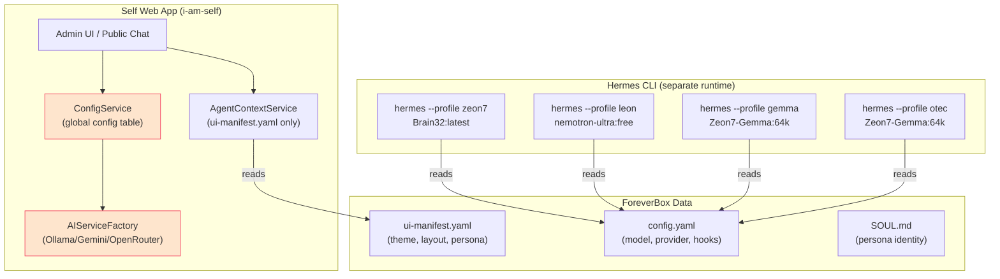

# Hermes Agent Control from the Self Web Interface

## Problem Statement

Your Hermes agents (Zeon7, Leon, Gemma, Otec, Wolf) each have their own full runtime configuration in `/foreverbox_data/profiles/{agent}/config.yaml`, including model assignments, providers, custom providers, hooks, and memory backends. However, the Self web interface (`i-am-self`) currently has **no bridge** to these Hermes configurations:

- The **admin settings page** manages a single global provider/model — it doesn't know about per-agent Hermes configs
- When you **switch agents** in the admin dropdown, only the UI theme and system prompt change — the actual AI model powering the chat stays the same global one
- There is **no way** to start, stop, monitor, or reconfigure a Hermes agent session from the web UI
- The Hermes `config.yaml` files are completely independent of the web app's MariaDB `config` table

## Current Architecture



> [!IMPORTANT]
> The red-highlighted boxes show the disconnect: `ConfigService` and `AIServiceFactory` use a single global config and have no awareness of per-agent Hermes configurations.

## Per-Agent Model Assignments (Current Hermes Configs)

| Agent | Default Model | Provider | Custom Provider |
|---|---|---|---|
| **Zeon7** | `Brain32:latest` | `custom:g4` | `Zeon7-Gemma:64k` (Ollama) |
| **Leon** | `nvidia/nemotron-3-ultra-550b-a55b:free` | `openrouter` | `fredrezones55/Gemma-4-Uncensored` (Ollama) |
| **Gemma** | `Zeon7-Gemma:64k` | `ollama` | — |
| **Otec** | `Zeon7-Gemma:64k` | `ollama` | — |
| **Wolf** | `Zeon7-Gemma:64k` | `ollama` | — |

## Proposed Changes

There are two levels of integration. I recommend **Level 1** as the immediate deliverable, with **Level 2** as a follow-up.

---

### Level 1: Per-Agent Model Routing in the Web Chat

Make the web app respect each agent's Hermes `config.yaml` when routing chat messages, so switching to Leon in the dropdown actually uses Leon's model/provider.

#### [MODIFY] [ConfigService.php](file:///var/www/self/src/services/ConfigService.php)

Add methods to read and parse an agent's `config.yaml`:
- `getAgentConfig(string $agentId): array` — parses `profiles/{agent}/config.yaml`
- `getModelForAgent(string $agentId): string` — returns `model.default`
- `getProviderForAgent(string $agentId): string` — returns `model.provider`, mapping `custom:*` and `openrouter` to the correct Self provider type
- `getOllamaModelForAgent(string $agentId): string` — resolves custom provider model names
- Fallback: if no `config.yaml` exists, use the global `config` table values

#### [MODIFY] [AIServiceFactory.php](file:///var/www/self/src/services/AIServiceFactory.php)

No structural changes needed — it already accepts provider/model/apiKey as parameters. The change is in who calls it.

#### [MODIFY] [chat.php](file:///var/www/self/api/chat.php)

Instead of:
```php
$provider = $this->configService->getCurrentProvider();
$model    = $this->configService->getCurrentModel();
```

Change to:
```php
$agentId  = $this->agentContext->getAgentId();
$provider = $this->configService->getProviderForAgent($agentId);
$model    = $this->configService->getModelForAgent($agentId);
```

This means when you switch to Leon in the admin dropdown and chat, the conversation goes through OpenRouter to `nemotron-ultra`, not through your local Ollama.

#### [MODIFY] [settings.php](file:///var/www/self/admin/settings.php) & [settings.js](file:///var/www/self/admin/js/settings.js)

Add a read-only "Agent Model Summary" panel showing each agent's current model assignment (read from their `config.yaml`), with the global settings serving as fallback defaults.

---

### Level 2: Full Hermes Session Management (Future)

This would allow starting/stopping/monitoring Hermes CLI sessions directly from the web UI:

- **Agent Dashboard Panel**: Show running Hermes processes, GPU status, active sessions
- **Launch/Stop Controls**: Trigger `fbox-launch {agent}` from the admin UI via a secure API endpoint
- **Config Editor**: Edit `config.yaml` model/provider settings from the admin UI and write them back to disk
- **Session Viewer**: Tail Hermes conversation logs in real-time from the admin interface

> [!WARNING]
> Level 2 requires careful security consideration (shell execution from web UI) and is a significantly larger scope. I recommend delivering Level 1 first.

---

## Open Questions

> [!IMPORTANT]
> **1. OpenRouter API Key for Leon**: Leon's Hermes config uses OpenRouter (`nvidia/nemotron-3-ultra-550b-a55b:free`). The Self web app already has an OpenRouter service — do you have an OpenRouter API key stored in the web app's `api_keys` table, or do we need to set one up?

> [!IMPORTANT]
> **2. Agent Chat Isolation**: When you switch to Leon and chat, should the chat use Leon's `SOUL.md` as the system prompt (instead of the `system_instructions` table), or should the current `InstructionService` per-agent component system take priority?

> [!IMPORTANT]
> **3. Scope Confirmation**: Should I proceed with **Level 1 only** (per-agent model routing in web chat + settings summary panel), or do you also want elements of Level 2 now?

## Verification Plan

### Automated Tests
- PHP syntax check on all modified files
- `curl` test to `/api/chat.php` with `?agent=leon` to verify it routes to OpenRouter
- `curl` test to `/api/chat.php` with `?agent=zeon7` to verify it routes to local Ollama
- Playwright browser test: switch agents in admin dropdown, send chat message, verify different model in response metadata

### Manual Verification
- Switch between agents in the admin UI and verify chat responses come from the correct model
- Check the settings page shows accurate per-agent model summary
- Deploy to VPS and verify live
